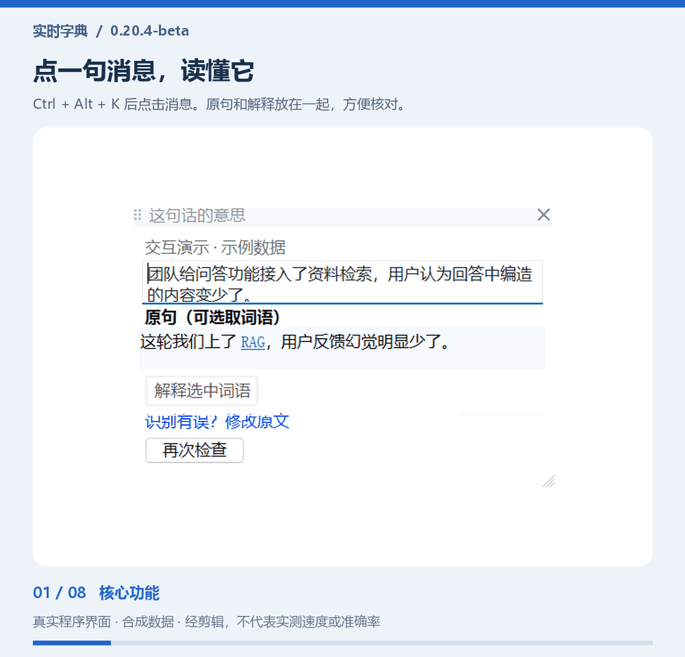
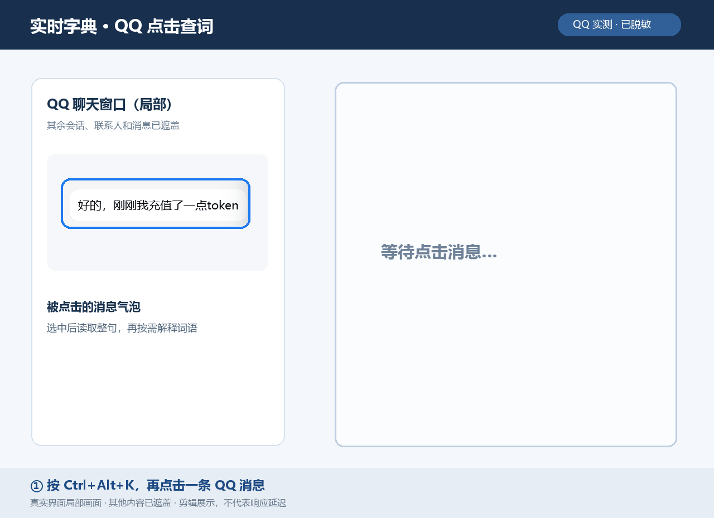
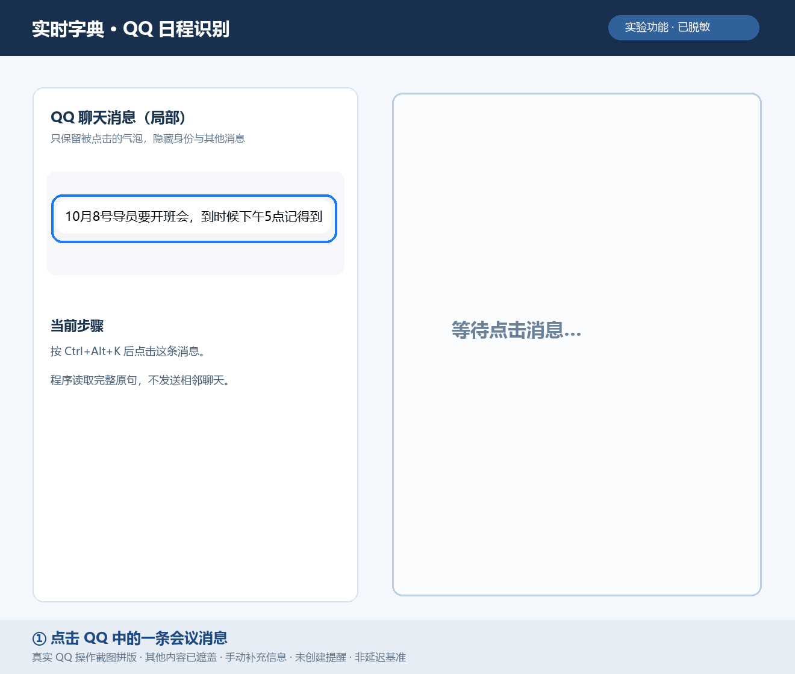
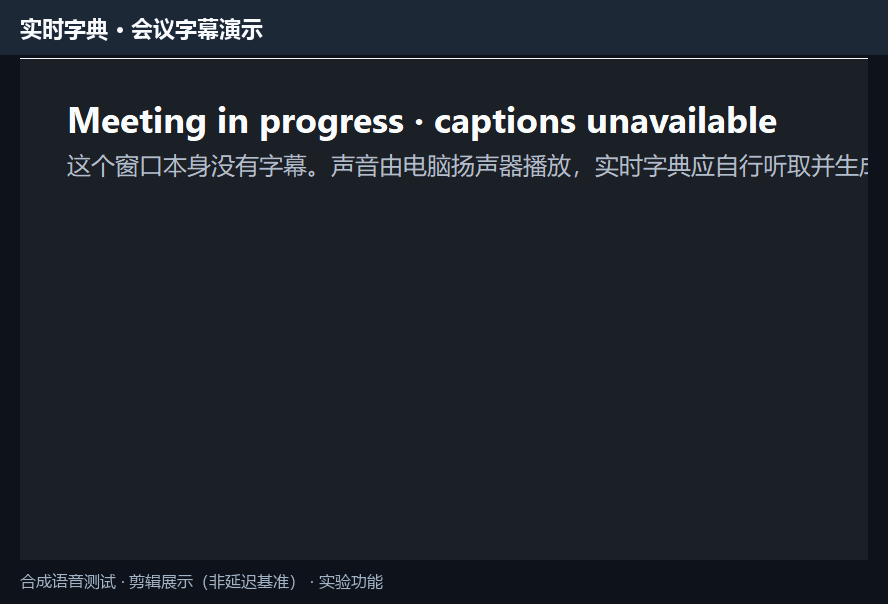

# 实时字典 · Realtime Dictionary

面向微信与 QQ 桌面聊天的 Windows 阅读助手。默认流程是先按 `Ctrl+Alt+K`，再在 10 秒内点击一条消息，先理解整条消息，再按需查看原文中的术语。整窗 OCR 高亮保留为显式兼容实验。

**当前为开发中的 Beta 源码快照。** 真实聊天软件兼容性、滚动跟随、多显示器和长时间会议仍需验证；不保证所有软件和布局都能准确识别。本仓库首次上传不包含安装包，历史本地安装包也不代表当前源码。

当前源码版本由 `semantic-overlay/version.txt` 定义（`0.20.4-beta`）。这一版完成宿主职责拆分，修复请求中修改输入后的按钮与迟到结果，并保留费用拦截、加密保存和数据控制；尚不代表已通过公司部署验收。

2026-10-03 补验：QQ 与微信各 3 条真实消息完成点击解释试跑；单显示器上实际横向/纵向独立调整浮框、保存与程序重启后恢复 1180×528 尺寸通过。六条消息不代表正式 50 条验收，也不能证明故障率低于 1%。详细范围见真实验收记录。

## 当前验证范围

- 微信与 QQ 共用的单次消息解释：按 `Ctrl+Alt+K` 后点击一次目标消息；优先读取完整消息控件，读不到时自动定位整个消息气泡并 OCR。
- 每次只发送当前消息，最多 1000 个字符；一次返回整段中文解释和 0-5 个原文术语。原文在面板中始终可见、可修改。
- 查词卡片立即打开；除含义确定的程序快捷键及已命中的结果缓存外，主动查词会请求
  在线 AI 解释。本地内容只用于等待期间的即时预览，不需要再点一次 AI 查询。
- 整窗 OCR、悬浮助手与原文高亮保留为兼容实验；Jev/TypeSafe 已移除。
- 递归查词、返回、主动选词查询与可编辑输入兜底。
- 日程作为需要确认的轻量辅助；会议字幕仍为实验能力，不属于当前成熟度承诺。

产品范围、指标和真实验收分别见 [PRODUCT_SCOPE.md](semantic-overlay/PRODUCT_SCOPE.md)、[METRICS.md](semantic-overlay/METRICS.md) 与 [REAL_WORLD_TEST_PROTOCOL.md](semantic-overlay/REAL_WORLD_TEST_PROTOCOL.md)。

## 效果演示

**新版功能导览（约 40 秒）**：当前原生程序界面，使用合成消息、预设解释和字幕数据；非现场模型/OCR/语音识别录像，不代表实际响应时间或准确率。日程停在确认前，字幕明确标为实验能力。



[下载 MP4，方便聊天分享](semantic-overlay/media/feature-tour.mp4) · [演示范围](semantic-overlay/media/README.md) · [版本与已知问题](semantic-overlay/RELEASE_NOTES.md)

下面保留历史真实 QQ 操作片段，旧版样式可能与当前界面不同。

主流程是 `Ctrl+Alt+K` → 单击微信或 QQ 的一条消息 → 阅读整句解释 → 按需点术语查看注释。下面的 QQ 动图由一次真实操作的三个画面拼成：点击消息后，程序解释整句；再点原文中的 `token`，查看它在该句中的含义。画面只保留被点击的气泡和解释面板，其他会话、联系人和消息均已遮盖；动图经过剪辑，不能用来衡量响应延迟。



下图展示独立的**QQ 日程识别实验功能**：点击真实 QQ 消息后，程序将“参加班会”列为待确认日程。原句只有“10 月 8 日下午 5 点”，因此确认窗口没有擅自填写年份、结束时间或时区。演示中手动补充了“2026 年、持续 1 小时、北京时间”，程序据此生成可编辑草稿；没有创建提醒或写入日历。动图只保留被点击的气泡和程序窗口，其他会话内容已遮盖；它是剪辑后的界面展示，不代表响应延迟。



下图展示独立的**会议字幕实验功能**：程序从合成语音测试窗口接收音频，在悬浮框里逐句显示英文字幕，并修正 `oneAPI`、`bootcamp` 等术语。



动图剪去了等待片段，仅演示界面效果，不能用来衡量延迟或证明真实会议的长时间稳定性。

## 从源码运行

需要 Windows x64、系统 .NET Framework C# 编译器、Windows PowerShell（Windows OCR 桥接）及 Python 3.10+。Windows 需安装所用语言的 OCR 组件。会议进程音频隔离能力取决于 Windows 版本和目标应用。

1. 克隆本仓库，确保 Python 可从 PATH 找到。
2. 双击 `semantic-overlay/start.cmd`。首次启动会构建原生宿主。
3. 从系统托盘配置解释模型；需要字幕时另外配置语音服务。连接测试会调用服务商，可能产生少量费用。
4. 按 `Ctrl+Alt+K`，在 10 秒内单击一条需要理解的消息。点击后待选状态自动结束。

| 操作 | 快捷键 |
| --- | --- |
| 进入一次消息待选状态（10 秒） | Ctrl+Alt+K |
| 清除实验高亮、结束实验会话 | Ctrl+Alt+G |
| 主动查询选中文字 | Ctrl+Alt+D |

程序没有主窗口；完全退出请使用系统托盘菜单。未暴露选中文字的应用会显示可编辑输入框。本地提醒需要托盘程序运行才能准时触发。

主路径的 Python 后端使用标准库。可选 PaddleOCR 备用路径另需 Pillow、PaddleOCR 和与机器匹配的 PaddlePaddle；备用路径的鉴权与内存截图处理已补齐，但其实际兼容性仍需单独验证。

## 模型配置

- 托盘中的“配置解释模型”独立保存文字服务的地址、模型及加密密钥，不覆盖语音服务；实验菜单的“配置语音 / 兼容分析服务”独立设置原兼容路由。也支持 `OPENAI_BASE_URL`、`OPENAI_MODEL` 及 `SILICONFLOW_API_KEY`、`DEEPSEEK_API_KEY`、`OPENAI_API_KEY`。实际优先级见 `server.py`。
- 托盘状态会分别显示当前高亮判断与解释引擎。高亮使用已配置的生成模型，未配置时使用明确标记的本地规则；状态显示仅证明进程加载了配置，不等于最近一次服务商调用成功。
- 查词和消息解释使用用户明确配置的文字模型，不再隐式切换到收费的小模型。新配置的硅基流动默认值为 `Qwen/Qwen2.5-7B-Instruct`，仍须通过实时免费价格检查。
- 硅基流动全部 DeepSeek 型号及收费模型被运行时拦截。发送前读取官方价格页，核实具体模型和接口的所有适用价格为零；短时内存核验缓存最多 15 分钟、不过夜。无法核实、价格页结构变化或非零价格都会阻止请求，不使用付费兜底。这无法保证服务商在核验间隔内不改价，最终账单以服务商为准。
- 语音转写复用独立的硅基流动配置，同样受免费拦截。旧的 `TeleAI/TeleSpeechASR` 未在当前官方价格页核实到，保留原配置但阻止上传；不会静默切换模型。官方 DeepSeek 文字路由不受硅基流动禁用范围影响。
- 托盘“今日模型用量”显示本机请求次数及服务商实际返回的输入/输出 token。记录位于 `%APPDATA%\RealtimeDictionary\provider-usage`，不包含请求正文、密钥、响应正文；超时、崩溃或未返回 usage 时标记未知，不能当作零费用。

浏览器扩展已移除。接下来的开发与自测安排见 [改进执行方案](semantic-overlay/IMPROVEMENT_PLAN.md)。

## 架构与目录

```text
semantic-overlay/
  native-host/   Windows 托盘、OCR、位置跟随、解释窗口和音频采集
  server.py      候选分析、模型适配、中文解释和本地 HTTP 服务
  ocr_service.py 可选备用 OCR 服务
  tests/         离线回归与测试工具
  installer/     安装器源码
  vendor/NAudio/ 音频依赖及原许可
```

主流程：按 `Ctrl+Alt+K` → 10 秒内单击一次消息 → 自动退出待选状态 → 读取完整控件文字或定位整个气泡 OCR → 整段中文解释 → 按需查看原文术语。未进入待选状态的普通点击不触发分析。拖选和手工修改只是失败兜底。模型不控制鼠标或直接执行提醒；创建提醒需要用户确认。

## 隐私和已知限制

- 第一次发送文字前明确告知目标服务商，用户同意后才调用；切换服务地址重新询问。会议转写另有语音发送及本地字幕保存告知。员工试用仅使用允许提交给该服务商的内容。
- 字幕文字默认按日期保存在本机，托盘可关闭后续保存；关闭后可查看本次内存字幕。记录窗口的“删除当天历史”仅在用户确认后删除选定日期，历史不会自动清除。
- 当前 Windows 用户目录会保存一份有上限的本地体验事件，用于统计取词来源、完整耗时、是否修正、反馈和高亮数量；不记录聊天正文、查询词、解释正文、截图、音频、联系人或密钥，可从托盘直接查看所在目录。
- 不要上传个人配置、密钥、日志、聊天截图或音频。公开源码采用 `.gitignore` 白名单。
- 新保存的密钥由 Windows 当前用户 DPAPI 加密，并绑定服务地址和凭证用途；不能拿到其他用户/地址使用。旧版明文配置只兼容读取并报告警告，不自动迁移现有密钥。日志不写查询词或服务商错误正文，但仍不应随意公开历史日志。
- 备用 OCR `/scan` 校验本机 Host 和主服务会话令牌，并将令牌传给分析服务；截图在内存处理，不再生成固定 `_native_scan.png`。旧版本遗留文件不会自动删除。不要将本地端口暴露到网络。
- 当前主服务绑定 127.0.0.1:8877，并通过产品标识、协议及应用版本握手。旧安装版或其他程序占用该端口时，当前宿主会明确拒绝连接；运行源码前仍应退出旧托盘实例。
- 滚动高亮依靠独立窗口和画面位移测量，无法保证与第三方文字逐帧同步。OCR 可能漏词或识别错误；模型解释也需要核对。
- 打包脚本依赖本地嵌入式 Python 运行环境等构建材料，这些不随源码上传。首次克隆优先按源码运行步骤使用。

## 开发验证

在 `semantic-overlay` 目录运行：

```powershell
python tests/run_offline.py
python -m py_compile ocr_service.py server.py
powershell -File native-host/build.ps1
```

原生诊断需要交互式 Windows 桌面。离线测试通过不等于真实会议或所有聊天软件通过验收。真实模型测试需明确限制调用预算。

## 许可

项目原创代码采用 [MIT License](LICENSE)。第三方组件保留各自许可，见 [THIRD_PARTY_NOTICES.md](THIRD_PARTY_NOTICES.md)。
